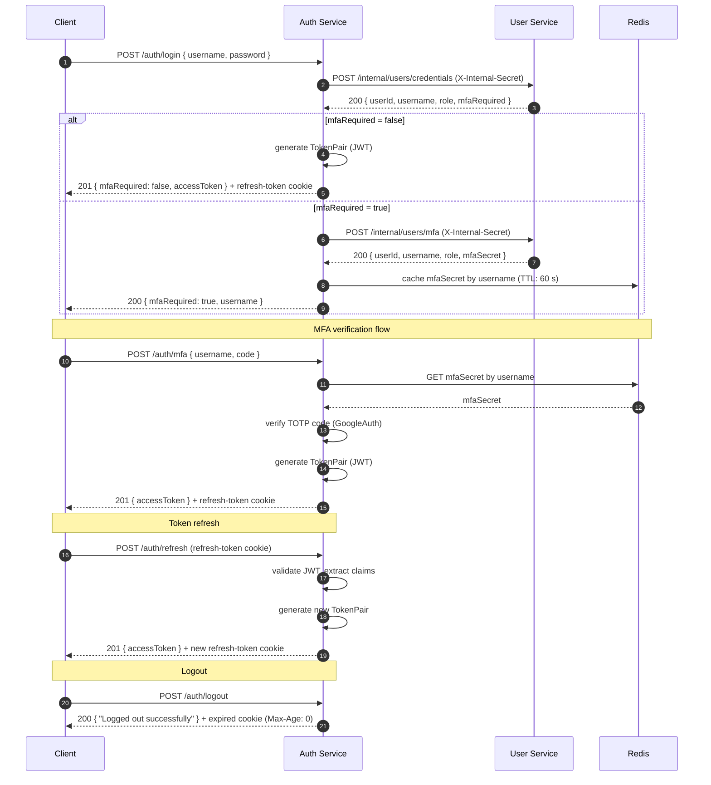
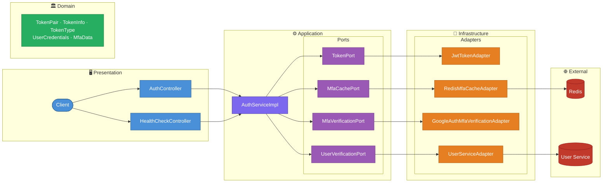

# 🔐 Auth Service - JWT Authentication & MFA Platform

[](https://spring.io/projects/spring-boot)
[](https://openjdk.org/)
[](https://www.docker.com/)
[](https://opensource.org/licenses/MIT)

<a id="overview"></a>
## 📖 Overview
[Back to Table of Contents](#toc)

Auth Service is a production-ready backend responsible for authenticating users across the platform. It handles password-based login, TOTP-based multi-factor authentication (MFA), JWT access token issuance, token refresh via HttpOnly cookie, and logout. Built with Hexagonal Architecture, it delegates credential and MFA data retrieval to the User Service over an internal HTTP channel secured with a shared secret, and caches MFA secrets temporarily in Redis.

<a id="toc"></a>
## 📚 Table of Contents
- [📖 Overview](#overview)
- [🔄 How It Works](#how-it-works)
- [🌐 API Endpoints](#api-endpoints)
- [🚀 Getting Started](#getting-started)
- [⚙️ Environment Variables](#environment-variables)
- [🛠️ Common Issues](#common-issues)
- [🏗️ Architecture](#architecture)
- [💻 Tech Stack](#tech-stack)
- [📂 Repository Structure](#repository-structure)
- [🤝 Contact](#contact)

---

<a id="how-it-works"></a>
## 🔄 How It Works
[Back to Table of Contents](#toc)

### Login without MFA

1. Client calls `POST /auth/login` — service forwards credentials to User Service via `POST /internal/users/credentials` (with `X-Internal-Secret` header)
2. User Service returns `userId`, `username`, `role`, and `mfaRequired: false`
3. Auth Service generates a JWT token pair (access + refresh), sets the refresh token as an `HttpOnly` cookie, and returns the access token in the response body

### Login with MFA

4. User Service returns `mfaRequired: true` — Auth Service fetches the TOTP secret via `POST /internal/users/mfa`, caches it in Redis (TTL: 60 s), and returns `{ mfaRequired: true, username }` to the client
5. Client calls `POST /auth/mfa` with `username` and TOTP `code` — Auth Service reads the cached secret from Redis, verifies the code using Google Authenticator, then generates and returns the token pair

### Token Refresh & Logout

6. Client calls `POST /auth/refresh` — Auth Service reads the `refresh-token` cookie, validates the JWT signature and claims, and issues a new token pair
7. Client calls `POST /auth/logout` — Auth Service immediately expires the `refresh-token` cookie (Max-Age: 0)



---

<a id="api-endpoints"></a>
## 🌐 API Endpoints
[Back to Table of Contents](#toc)

**Base URL:** `http://localhost:${SERVER_PORT}`

### Auth Endpoints

| Method | Path | Purpose | Request Body | Success | Common Errors |
|--------|------|---------|--------------|---------|---------------|
| `POST` | `/auth/login` | Authenticate with username and password | `LoginRequestDto` | `200 OK` (MFA required) / `201 Created` | `400`, `401` |
| `POST` | `/auth/mfa` | Verify TOTP code and complete login | `VerifyMfaRequestDto` | `201 Created` | `400`, `401` |
| `POST` | `/auth/refresh` | Issue a new access token using refresh cookie | — (cookie) | `201 Created` | `400`, `401` |
| `POST` | `/auth/logout` | Invalidate the refresh token cookie | — | `200 OK` | — |

### Health Endpoints

| Method | Path | Purpose | Success |
|--------|------|---------|---------| 
| `GET` | `/actuator/health` | Actuator health check | `200 OK` |

The `refresh-token` cookie is `HttpOnly`, scoped to the path `/auth/refresh`, and has a `Max-Age` of 3000 seconds. Set `Secure=true` in production (HTTPS).

### cURL Examples

```bash
# Login (no MFA)
curl -X POST http://localhost:8084/auth/login \
  -H "Content-Type: application/json" \
  -c cookies.txt \
  -d '{"username": "john", "password": "Secret123!"}'

# Login (MFA required) — step 1
curl -X POST http://localhost:8084/auth/login \
  -H "Content-Type: application/json" \
  -d '{"username": "john", "password": "Secret123!"}'
# Response: { "mfaRequired": true, "username": "john" }

# Login (MFA required) — step 2
curl -X POST http://localhost:8084/auth/mfa \
  -H "Content-Type: application/json" \
  -c cookies.txt \
  -d '{"username": "john", "code": "482910"}'

# Refresh access token
curl -X POST http://localhost:8084/auth/refresh \
  -b cookies.txt -c cookies.txt

# Logout
curl -X POST http://localhost:8084/auth/logout \
  -b cookies.txt -c cookies.txt
```

---

<a id="getting-started"></a>
## 🚀 Getting Started
[Back to Table of Contents](#toc)

### Prerequisites

- Docker and Docker Compose v2+
- Java 25+ and Maven 3.9+ (for local builds only)
- A running instance of `security-user-service` accessible from the Docker network

### Environment Configuration

Create a `.env` file in the project root:

```dotenv
# ─── Application ─────────────────────────────────────────────────────────────
AUTH_SERVICE_PORT=8084
AUTH_SERVICE_APPLICATION_NAME=auth-service

# ─── JWT ─────────────────────────────────────────────────────────────────────
AUTH_JWT_SECRET=changeme_jwt_secret_min_32_chars
AUTH_JWT_ACCESS_TOKEN_EXPIRATION_MS=900000
AUTH_JWT_REFRESH_TOKEN_EXPIRATION_MS=604800000

# ─── User Service ────────────────────────────────────────────────────────────
AUTH_USER_SERVICE_URL=http://user-service:8081
AUTH_SERVICE_INTERNAL_SECRET=changeme_internal_secret

# ─── Redis ───────────────────────────────────────────────────────────────────
AUTH_REDIS_HOST=auth-redis
AUTH_REDIS_PORT=6379
AUTH_REDIS_PASSWORD=changeme_redis_password
```

### Start the Service

```bash
docker compose up -d --build
```

Verify: `curl http://localhost:8084/actuator/health` → `{"status":"UP"}`

---

<a id="environment-variables"></a>
## ⚙️ Environment Variables
[Back to Table of Contents](#toc)

### Application

| Variable | Required | Description | Example |
|----------|----------|-------------|---------|
| `SERVER_PORT` | yes | HTTP port the service listens on | `8084` |
| `SPRING_APPLICATION_NAME` | optional | Spring application name | `auth-service` |

### JWT

| Variable | Required | Description | Example |
|----------|----------|-------------|---------|
| `JWT_SECRET` | yes | HMAC secret for signing and verifying JWTs (min. 32 chars) | `super_secret_key_min_32_chars` |
| `JWT_ACCESS_TOKEN_EXPIRATION_MS` | yes | Access token lifetime in milliseconds | `900000` (15 min) |
| `JWT_REFRESH_TOKEN_EXPIRATION_MS` | yes | Refresh token lifetime in milliseconds | `604800000` (7 days) |

### User Service

| Variable | Required | Description | Example |
|----------|----------|-------------|---------|
| `USER_SERVICE_URL` | yes | Base URL of the User Service | `http://user-service:8081` |
| `INTERNAL_SECRET` | yes | Shared secret sent as `X-Internal-Secret` header to User Service | `super_secret_value` |

### Redis

| Variable | Required | Description | Example |
|----------|----------|-------------|---------|
| `REDIS_HOST` | yes | Redis hostname | `auth-redis` |
| `REDIS_PORT` | yes | Redis port | `6379` |
| `REDIS_PASSWORD` | yes | Redis password | `changeme_redis_password` |

---

<a id="common-issues"></a>
## 🛠️ Common Issues
[Back to Table of Contents](#toc)

1. **User Service unreachable / 503** — verify `USER_SERVICE_URL` points to the correct host and port visible from within the Docker network. Check with `docker compose logs auth-service | grep -i "user-service"`. The REST client has a connect timeout of 2 000 ms and read timeout of 5 000 ms.

2. **Redis connection refused** — `auth-redis` must be healthy before `auth-service` starts (enforced by `depends_on: condition: service_healthy`). Inspect with `docker compose ps auth-redis` and `docker compose logs auth-redis`.

3. **Invalid or expired access token on other services** — ensure `JWT_SECRET` is identical across all services that verify JWTs. A mismatch causes signature validation to fail silently.

4. **MFA code rejected (`401`)** — the MFA secret is cached in Redis for 60 seconds. If the client takes longer than 60 s between `/auth/login` and `/auth/mfa`, the cache entry expires and the login must be restarted. TOTP codes are also time-sensitive (±1 window by default).

5. **Refresh token cookie not sent** — the cookie is scoped to `Path=/auth/refresh` and is `HttpOnly`. Ensure the HTTP client sends cookies automatically and targets the correct path. In production, `Secure` must be enabled and the service must be served over HTTPS.

---

<a id="architecture"></a>
## 🏗️ Architecture
[Back to Table of Contents](#toc)



**Technical Highlights:**

- **Hexagonal Architecture:** Domain and application layers are completely decoupled from infrastructure — `TokenPort`, `MfaCachePort`, `MfaVerificationPort`, and `UserVerificationPort` define contracts; adapters implement them without leaking infrastructure details into business logic.
- **JWT Token Pair:** `JwtTokenAdapter` uses JJWT 0.12.5 to issue signed access and refresh tokens. Claims carry `userId`, `username`, and `role`. Refresh tokens are bound to the `/auth/refresh` path via an `HttpOnly` cookie, never exposed to JavaScript.
- **TOTP MFA:** `GoogleAuthMfaVerificationAdapter` wraps the `googleauth` library to validate 6-digit TOTP codes against secrets stored in User Service. The secret is fetched once per login attempt and cached in Redis with a 60-second TTL (`mfa:secret:<username>`).
- **Redis MFA Cache:** `RedisMfaCacheAdapter` uses Spring Data Redis with Lettuce connection pooling (max 20 active, max 10 idle). Entries are automatically evicted by TTL — no manual cleanup required.
- **Stateless HTTP Client:** `UserServiceAdapter` uses Spring `RestClient` to call User Service. Authentication uses a shared `INTERNAL_SECRET` header — the same constant-time check as on the User Service side prevents timing attacks.
- **Virtual Threads + container-aware JVM:** `spring.threads.virtual.enabled=true` with `-XX:+UseContainerSupport -XX:MaxRAMPercentage=75.0 -XX:+UseG1GC`.

---

<a id="tech-stack"></a>
## 💻 Tech Stack
[Back to Table of Contents](#toc)

| Layer | Technology |
|-------|------------|
| Language | Java 25 (virtual threads via Project Loom) |
| Framework | Spring Boot 4.0.6 |
| Web | Spring WebMVC, Spring Validation |
| HTTP Client | Spring RestClient |
| Cache | Spring Data Redis, Lettuce, commons-pool2 |
| JWT | JJWT 0.12.5 (jjwt-api / jjwt-impl / jjwt-jackson) |
| MFA | Google Authenticator (`googleauth` 1.5.0) |
| Build | Maven 3.9 |
| Testing | JUnit 5 |
| Containerisation | Docker, multi-stage build |
| Observability | Spring Boot Actuator |
| Utilities | Lombok |


---

<a id="repository-structure"></a>
## 📂 Repository Structure
[Back to Table of Contents](#toc)

```text
.
├── auth-service/
│   ├── src/
│   │   ├── main/
│   │   │   ├── java/com/rzodeczko/
│   │   │   │   ├── application/
│   │   │   │   │   ├── command/              # LoginCommand, RefreshTokenCommand,
│   │   │   │   │   │                         #   VerifyMfaCommand
│   │   │   │   │   ├── dto/                  # LoginResultDto, TokenPairDto
│   │   │   │   │   ├── port/                 # MfaCachePort, MfaVerificationPort,
│   │   │   │   │   │                         #   TokenPort, UserVerificationPort
│   │   │   │   │   └── service/              # AuthService (interface),
│   │   │   │   │                             #   AuthServiceImpl
│   │   │   │   ├── domain/
│   │   │   │   │   ├── exception/            # InvalidTokenException,
│   │   │   │   │   │                         #   MfaAuthorizationFailedException,
│   │   │   │   │   │                         #   UserServiceUnavailableException
│   │   │   │   │   └── model/                # MfaData, TokenInfo, TokenPair,
│   │   │   │   │                             #   TokenType, UserCredentials
│   │   │   │   ├── infrastructure/
│   │   │   │   │   ├── adapter/              # UserServiceAdapter
│   │   │   │   │   │   └── dto/              # GetMfaDataRequestDto, MfaDataResponseDto,
│   │   │   │   │   │                         #   VerifyCredentialsRequestDto,
│   │   │   │   │   │                         #   VerifyCredentialsResponseDto
│   │   │   │   │   ├── cache/                # RedisMfaCacheAdapter
│   │   │   │   │   ├── configuration/        # BeanConfiguration
│   │   │   │   │   │   └── properties/       #   JwtProperties, MfaCacheProperties,
│   │   │   │   │   │                         #   UserServiceProperties
│   │   │   │   │   ├── mfa/                  # GoogleAuthMfaVerificationAdapter
│   │   │   │   │   └── token/                # JwtTokenAdapter
│   │   │   │   └── presentation/
│   │   │   │       ├── controller/           # AuthController, HealthCheckController
│   │   │   │       ├── dto/
│   │   │   │       │   ├── request/          # LoginRequestDto, VerifyMfaRequestDto
│   │   │   │       │   └── response/         # AccessTokenResponseDto, ApiResponseDto,
│   │   │   │       │                         #   HealthCheckResponseDto, LoginResponseDto
│   │   │   │       └── exception/            # GlobalExceptionHandler
│   │   │   └── resources/
│   │   │       └── application.yaml          # App config (virtual threads, Redis pool,
│   │   │                                     #   JWT expiry, user-service URL, MFA TTL)
│   │   └── test/
│   │       └── java/com/rzodeczko/
│   │           └── AuthServiceApplicationTests.java   # Spring context smoke test
│   ├── Dockerfile                            # Multi-stage build (maven → jre-alpine, non-root user)
│   └── pom.xml                               # Maven build descriptor
└── docker-compose.yml                        # auth-service + auth-redis (Redis 8.2)
```

---

<a id="contact"></a>
## 🤝 Contact
[Back to Table of Contents](#toc)

Designed and implemented by **Michał Rzodeczko**.

GitHub: [mrzodeczko-dev](https://github.com/mrzodeczko-dev)
