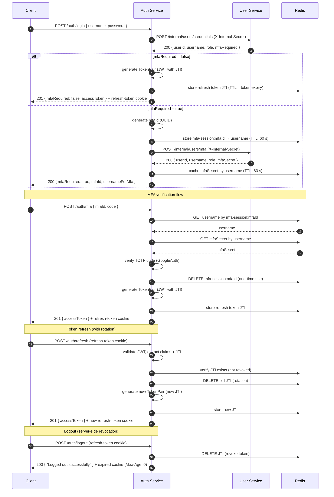
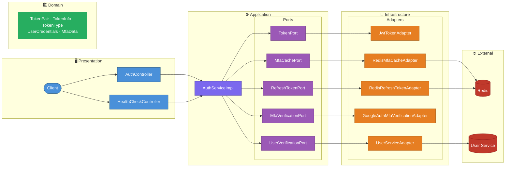

# 🔐 Auth Service - JWT Authentication & MFA Platform

[](https://spring.io/projects/spring-boot)
[](https://openjdk.org/)
[](https://www.docker.com/)
[](https://opensource.org/licenses/MIT)

<a id="overview"></a>
## 📖 Overview
[Back to Table of Contents](#toc)

Auth Service is a production-ready backend responsible for authenticating users across the platform. It handles password-based login, TOTP-based multi-factor authentication (MFA), JWT access token issuance, token refresh via HttpOnly cookie, and logout. Built with Hexagonal Architecture, it delegates credential and MFA data retrieval to the User Service over an internal HTTP channel secured with a shared secret, and caches MFA secrets temporarily in Redis.

<a id="toc"></a>
## 📚 Table of Contents
- [📖 Overview](#overview)
- [🔄 How It Works](#how-it-works)
- [🌐 API Endpoints](#api-endpoints)
- [🚀 Getting Started](#getting-started)
- [⚙️ Environment Variables](#environment-variables)
- [🛠️ Common Issues](#common-issues)
- [🏗️ Architecture](#architecture)
- [💻 Tech Stack](#tech-stack)
- [🧪 Testing](#testing)
- [📂 Repository Structure](#repository-structure)
- [🤝 Contact](#contact)

---

<a id="how-it-works"></a>
## 🔄 How It Works
[Back to Table of Contents](#toc)

### Login without MFA

1. Client calls `POST /auth/login` — service forwards credentials to User Service via `POST /internal/users/credentials` (with `X-Internal-Secret` header)
2. User Service returns `userId`, `username`, `role`, and `mfaRequired: false`
3. Auth Service generates a JWT token pair (access + refresh), sets the refresh token as an `HttpOnly` cookie, and returns the access token in the response body

### Login with MFA

4. User Service returns `mfaRequired: true` — Auth Service generates a unique `mfaId`, binds it to the username in Redis, fetches the TOTP secret via `POST /internal/users/mfa`, caches it in Redis (TTL: 60 s), and returns `{ mfaRequired: true, mfaId, usernameForMfa }` to the client
5. Client calls `POST /auth/mfa` with `mfaId` and TOTP `code` — Auth Service resolves the username from the `mfaId` session in Redis, reads the cached TOTP secret, verifies the code using Google Authenticator, then generates and returns the token pair. The `mfaId` session is deleted after successful verification (one-time use)

### Token Refresh & Logout

6. Client calls `POST /auth/refresh` — Auth Service reads the `refresh-token` cookie, validates the JWT signature and claims, verifies the token's JTI exists in Redis (not revoked), performs **token rotation** (revokes the old JTI, stores the new one), and issues a new token pair
7. Client calls `POST /auth/logout` — Auth Service reads the `refresh-token` cookie, revokes the token's JTI in Redis (server-side invalidation), and expires the cookie (Max-Age: 0)



---

<a id="api-endpoints"></a>
## 🌐 API Endpoints
[Back to Table of Contents](#toc)

**Base URL:** `http://localhost:${SERVER_PORT}`

### Auth Endpoints

| Method | Path | Purpose | Request Body | Success | Common Errors |
|--------|------|---------|--------------|---------|---------------|
| `POST` | `/auth/login` | Authenticate with username and password | `LoginRequestDto` | `200 OK` (MFA required) / `201 Created` | `400`, `401` |
| `POST` | `/auth/mfa` | Verify TOTP code and complete login | `VerifyMfaRequestDto` | `201 Created` | `400`, `401` |
| `POST` | `/auth/refresh` | Issue a new access token using refresh cookie | — (cookie) | `201 Created` | `400`, `401` |
| `POST` | `/auth/logout` | Revoke refresh token (Redis) and expire cookie | — (cookie, optional) | `200 OK` | — |

### Health Endpoints

| Method | Path | Purpose | Success |
|--------|------|---------|---------| 
| `GET` | `/actuator/health` | Actuator health check | `200 OK` |

The `refresh-token` cookie is `HttpOnly`, scoped to the path `/auth/refresh`, and has a `Max-Age` of 3000 seconds. Set `Secure=true` in production (HTTPS).

### cURL Examples

```bash
# Login (no MFA)
curl -X POST http://localhost:8084/auth/login \
  -H "Content-Type: application/json" \
  -c cookies.txt \
  -d '{"username": "john", "password": "Secret123!"}'

# Login (MFA required) — step 1
curl -X POST http://localhost:8084/auth/login \
  -H "Content-Type: application/json" \
  -d '{"username": "john", "password": "Secret123!"}'
# Response: { "mfaRequired": true, "mfaId": "abc-123-...", "usernameForMfa": "john" }

# Login (MFA required) — step 2
curl -X POST http://localhost:8084/auth/mfa \
  -H "Content-Type: application/json" \
  -c cookies.txt \
  -d '{"mfaId": "abc-123-...", "code": 482910}'

# Refresh access token
curl -X POST http://localhost:8084/auth/refresh \
  -b cookies.txt -c cookies.txt

# Logout
curl -X POST http://localhost:8084/auth/logout \
  -b cookies.txt -c cookies.txt
```

---

<a id="getting-started"></a>
## 🚀 Getting Started
[Back to Table of Contents](#toc)

### Prerequisites

- Docker and Docker Compose v2+
- Java 25+ and Maven 3.9+ (for local builds only)
- A running instance of `security-user-service` accessible from the Docker network

### Environment Configuration

Copy the example and fill in secrets:

```bash
cp .env.example .env
```

See `.env.example` for all required variables with descriptions.

### Start the Service

```bash
docker compose up -d --build
```

Verify: `curl http://localhost:8084/actuator/health` → `{"status":"UP"}`

---

<a id="environment-variables"></a>
## ⚙️ Environment Variables
[Back to Table of Contents](#toc)

| Variable | Required | Description | Default |
|----------|----------|-------------|---------|
| `AUTH_SERVICE_PORT` | yes | Host port mapped to the service | `8084` |
| `AUTH_REDIS_HOST` | yes | Redis host | `auth-redis` |
| `AUTH_REDIS_PORT` | yes | Redis port | `6379` |
| `AUTH_REDIS_PASSWORD` | yes | Redis password | - |
| `AUTH_JWT_SECRET` | yes | Base64-encoded HMAC-SHA512 key (min 64 bytes). Generate: `openssl rand -base64 64 \| tr -d '\n'`. Must match `API_GATEWAY_JWT_SECRET` | - |
| `AUTH_JWT_ACCESS_TOKEN_EXPIRATION_MS` | yes | Access token TTL in ms | `300000` (5 min) |
| `AUTH_JWT_REFRESH_TOKEN_EXPIRATION_MS` | yes | Refresh token TTL in ms | `3000000` (~50 min) |
| `AUTH_USER_SERVICE_URL` | yes | User Service base URL | `http://user-service:8083` |
| `AUTH_SERVICE_INTERNAL_SECRET` | yes | Shared secret for User Service internal API. Must match `USER_SERVICE_INTERNAL_SECRET` | - |
| `SPRINGDOC_API_DOCS_SWAGGER_ENABLED` | no | Enable Swagger UI | `false` |

---

<a id="common-issues"></a>
## 🛠️ Common Issues
[Back to Table of Contents](#toc)

1. **User Service unreachable / 503** — verify `USER_SERVICE_URL` points to the correct host and port visible from within the Docker network. Check with `docker compose logs auth-service | grep -i "user-service"`. The REST client has a connect timeout of 2 000 ms and read timeout of 5 000 ms.

2. **Redis connection refused** — `auth-redis` must be healthy before `auth-service` starts (enforced by `depends_on: condition: service_healthy`). Inspect with `docker compose ps auth-redis` and `docker compose logs auth-redis`.

3. **Invalid or expired access token on other services** — ensure `JWT_SECRET` is identical across all services that verify JWTs. A mismatch causes signature validation to fail silently.

4. **MFA code rejected (`401`)** — the MFA secret is cached in Redis for 60 seconds. If the client takes longer than 60 s between `/auth/login` and `/auth/mfa`, the cache entry expires and the login must be restarted. TOTP codes are also time-sensitive (±1 window by default).

5. **Refresh token cookie not sent** — the cookie is scoped to `Path=/auth/refresh` and is `HttpOnly`. Ensure the HTTP client sends cookies automatically and targets the correct path. In production, `Secure` must be enabled and the service must be served over HTTPS.

---

<a id="architecture"></a>
## 🏗️ Architecture
[Back to Table of Contents](#toc)



**Technical Highlights:**

- **Hexagonal Architecture:** Domain and application layers are completely decoupled from infrastructure — `TokenPort`, `MfaCachePort`, `MfaVerificationPort`, `UserVerificationPort`, and `RefreshTokenPort` define contracts; adapters implement them without leaking infrastructure details into business logic.
- **JWT Token Pair with JTI:** `JwtTokenAdapter` uses JJWT 0.12.5 to issue signed access and refresh tokens. Claims carry `userId`, `username`, and `role`. Refresh tokens include a unique `jti` (JWT ID) claim for server-side binding. Refresh tokens are bound to the `/auth/refresh` path via an `HttpOnly` cookie, never exposed to JavaScript.
- **Refresh Token Binding & Rotation:** `RedisRefreshTokenAdapter` stores each refresh token's JTI in Redis (key: `refresh-token:{jti}`, TTL = token expiry). On refresh, the old JTI is revoked and a new one is stored (rotation). On logout, the JTI is deleted (server-side revocation). Tokens not found in Redis are rejected with `RefreshTokenRevokedException`.
- **TOTP MFA with session binding:** `GoogleAuthMfaVerificationAdapter` wraps the `googleauth` library to validate 6-digit TOTP codes against secrets stored in User Service. The secret is fetched once per login attempt and cached in Redis with a 60-second TTL (`mfa:secret:<username>`). MFA verification is bound to a specific login via `mfaId` — a UUID stored in Redis (`mfa-session:{mfaId}` → username), deleted after one-time use.
- **Redis Cache:** `RedisMfaCacheAdapter` and `RedisRefreshTokenAdapter` use Spring Data Redis with Lettuce connection pooling (max 20 active, max 10 idle). Entries are automatically evicted by TTL — no manual cleanup required.
- **Stateless HTTP Client:** `UserServiceAdapter` uses Spring `RestClient` to call User Service. Authentication uses a shared `INTERNAL_SECRET` header — the same constant-time check as on the User Service side prevents timing attacks.
- **Virtual Threads + container-aware JVM:** `spring.threads.virtual.enabled=true` with `-XX:+UseContainerSupport -XX:MaxRAMPercentage=75.0 -XX:+UseG1GC`.

---

<a id="tech-stack"></a>
## 💻 Tech Stack
[Back to Table of Contents](#toc)

| Layer | Technology |
|-------|------------|
| Language | Java 25 (virtual threads via Project Loom) |
| Framework | Spring Boot 4.0.6 |
| Web | Spring WebMVC, Spring Validation |
| HTTP Client | Spring RestClient |
| Cache | Spring Data Redis, Lettuce, commons-pool2 |
| JWT | JJWT 0.12.5 (jjwt-api / jjwt-impl / jjwt-jackson) |
| MFA | Google Authenticator (`googleauth` 1.5.0) |
| Build | Maven 3.9 |
| Testing | JUnit 5, Testcontainers 1.21, WireMock 3.10, Mockito 5 |
| Containerisation | Docker, multi-stage build |
| Observability | Spring Boot Actuator |
| Utilities | Lombok |


---

<a id="testing"></a>
## 🧪 Testing
[Back to Table of Contents](#toc)

The service has a full integration test suite covering all HTTP endpoints and infrastructure adapters. Tests run against real infrastructure (Redis via Testcontainers) and a stubbed HTTP server (WireMock) that simulates User Service. No mocks replace real Spring beans except `MfaVerificationPort` (TOTP verification), which is swapped with a Mockito bean to avoid time-sensitive TOTP code generation in tests.

### Running Tests

```bash
mvn test
```

Docker must be running — Testcontainers starts a `redis:8.2-alpine` container automatically before the tests execute.

### Test Infrastructure

| Component | Technology | Role |
|-----------|------------|------|
| Redis | Testcontainers `redis:8.2-alpine` | Real Redis instance for cache tests |
| User Service | WireMock 3.10.0 | HTTP stub replacing the real User Service |
| TOTP verification | Mockito `@MockitoBean` | Bypasses time-sensitive TOTP code checks |

**Base classes:**

- **`AbstractRedisIntegrationTest`** — starts a `redis:8.2-alpine` container via `@Container` static field; registers `spring.data.redis.*` properties via `@DynamicPropertySource`.
- **`AbstractWireMockIntegrationTest`** — extends the above; starts WireMock on a dynamic port with HTTP/2 disabled (`.http2PlainDisabled(true)` — prevents RST_STREAM issues with Spring Boot 4's default JDK HTTP client); registers `user-service.url` dynamically; resets all stubs in `@BeforeEach`.

### Test Classes

#### `AuthServiceImplTest` — 12 tests

Unit test (`@ExtendWith(MockitoExtension.class)`) covering all service methods with mocked ports.

| Test | Scenario |
|------|----------|
| `login_withoutMfa_returnsTokenPairAndStoresRefreshToken` | Happy path — tokens generated, JTI stored in Redis |
| `login_withMfaRequired_returnsMfaIdAndFlag_andSkipsTokenGeneration` | MFA path — mfaId generated, no token/refresh token stored |
| `verifyMfa_validMfaId_cacheHit_verifiesAndStoresRefreshToken` | MFA happy path — TOTP verified, JTI stored |
| `verifyMfa_validMfaId_cacheMiss_fetchesFromUserServiceAndCaches` | Cache miss fallback — MFA data fetched from User Service |
| `verifyMfa_invalidMfaId_throwsMfaSessionNotFoundException` | Invalid mfaId — 401 |
| `verifyMfa_validMfaId_invalidCode_throwsMfaAuthorizationFailedException` | Wrong TOTP code — 401 |
| `refresh_validRefreshToken_rotatesAndReturnsNewTokenPair` | Rotation — old JTI deleted, new JTI stored |
| `refresh_revokedToken_throwsRefreshTokenRevokedException` | Revoked token (JTI missing) — 401 |
| `refresh_accessTokenPassedAsRefresh_throwsInvalidTokenException` | Wrong token type — 401 |
| `refresh_malformedToken_throwsInvalidTokenException` | Garbage token — 401 |
| `logout_validToken_deletesRefreshTokenFromStore` | Logout — JTI deleted from Redis |
| `logout_expiredOrInvalidToken_doesNotThrow` | Expired token on logout — silently ignored |

#### `JwtTokenAdapterTest` — 8 tests

Unit test for JWT generation and parsing.

| Test | Scenario |
|------|----------|
| `generate_producesNonBlankDistinctTokens` | Access and refresh tokens are non-blank and different |
| `parseAccessToken_returnsCorrectClaims` | Access token claims: userId, username, role, type=ACCESS |
| `parseRefreshToken_returnsRefreshTypeWithJti` | Refresh token: type=REFRESH, JTI is present |
| `parseAccessToken_hasNoJti` | Access token has no JTI (null) |
| `generate_producesUniqueJtiPerRefreshToken` | Each generation produces a unique JTI |
| `parse_garbageString_throwsInvalidTokenException` | Malformed JWT — exception |
| `parse_wrongSignature_throwsInvalidTokenException` | Wrong key — exception |
| `parse_expiredToken_throwsInvalidTokenException` | Expired JWT — exception |

#### `AuthControllerIT` — 14 tests

Full-stack Spring MVC integration test (`@SpringBootTest` + `@AutoConfigureMockMvc`). Covers all four endpoints with a real Spring context, real Redis, and WireMock for the User Service.

| Test | Scenario |
|------|----------|
| `login_noMfa_returns201WithAccessTokenAndRefreshCookie` | Happy path — no MFA: access token in body, HttpOnly refresh cookie set |
| `login_mfaRequired_returns200WithMfaIdAndFlag` | MFA path — returns `mfaRequired: true` with `mfaId`, no token issued |
| `login_blankUsername_returns400` | Bean Validation — blank username rejected |
| `login_blankPassword_returns400` | Bean Validation — blank password rejected |
| `login_userServiceReturns401_propagates401` | Upstream error — 401 from User Service propagated as 401 |
| `mfa_validMfaIdAndCode_returns201WithAccessTokenAndCookie` | MFA happy path — correct mfaId + TOTP code issues full token pair |
| `mfa_validMfaId_invalidCode_returns401` | MFA failure — wrong TOTP code returns 401 |
| `mfa_invalidMfaId_returns401` | Invalid mfaId (not in Redis) — 401 |
| `mfa_codeOutOfRange_returns400` | Bean Validation — code below 100 000 rejected |
| `mfa_validMfaId_cacheMiss_fetchesFromUserService` | Cache miss — fetches MFA data from User Service via WireMock |
| `refresh_validCookie_returns201WithNewToken` | Token rotation — valid cookie + JTI in Redis → new token pair, old JTI revoked |
| `refresh_revokedToken_returns401` | JTI not in Redis (revoked) — 401 |
| `refresh_noCookie_returns400` | Missing cookie — `MissingRequestCookieException` handled as 400 |
| `refresh_invalidToken_returns401` | Invalid JWT in cookie — 401 |
| `logout_withCookie_returns200AndRevokesToken` | Logout with cookie — JTI revoked in Redis, cookie expired |
| `logout_withoutCookie_returns200` | Logout without cookie — still returns 200 |

#### `RedisMfaCacheAdapterIT` — 8 tests

Infrastructure test against real Redis. Extends `AbstractRedisIntegrationTest` directly.

| Test | Scenario |
|------|----------|
| `put_thenGet_returnsStoredValue` | Store and retrieve `MfaData` — all fields preserved after serialization |
| `get_missingKey_returnsEmpty` | Cache miss — returns `Optional.empty()` |
| `invalidate_removesEntry` | Invalidation — entry deleted from Redis |
| `put_overwritesExistingEntry` | Second `put` for the same key replaces the previous value |
| `get_preservesUuid` | UUID is correctly serialized and deserialized via Jackson |
| `storeMfaSession_thenGetMfaSession_returnsUsername` | MFA session binding — mfaId → username stored and retrieved |
| `getMfaSession_missingKey_returnsEmpty` | Missing mfaId — returns empty |
| `deleteMfaSession_removesEntry` | MFA session deleted from Redis |

#### `RedisRefreshTokenAdapterIT` — 4 tests

Infrastructure test for refresh token storage in Redis.

| Test | Scenario |
|------|----------|
| `save_thenExists_returnsTrue` | Store JTI — exists returns true |
| `exists_missingKey_returnsFalse` | Missing JTI — exists returns false |
| `delete_removesEntry` | Delete JTI — no longer exists |
| `save_multipleTokensForSameUser_allExistIndependently` | Multiple JTIs for same user — independent lifecycle |

---

<a id="repository-structure"></a>
## 📂 Repository Structure
[Back to Table of Contents](#toc)

```text
.
├── auth-service/
│   ├── src/
│   │   ├── main/
│   │   │   ├── java/com/rzodeczko/
│   │   │   │   ├── application/
│   │   │   │   │   ├── command/              # LoginCommand, LogoutCommand,
│   │   │   │   │   │                         #   RefreshTokenCommand, VerifyMfaCommand
│   │   │   │   │   ├── dto/                  # LoginResultDto, TokenPairDto
│   │   │   │   │   ├── port/                 # MfaCachePort, MfaVerificationPort,
│   │   │   │   │   │                         #   RefreshTokenPort, TokenPort,
│   │   │   │   │   │                         #   UserVerificationPort
│   │   │   │   │   └── service/              # AuthService (interface),
│   │   │   │   │                             #   AuthServiceImpl
│   │   │   │   ├── domain/
│   │   │   │   