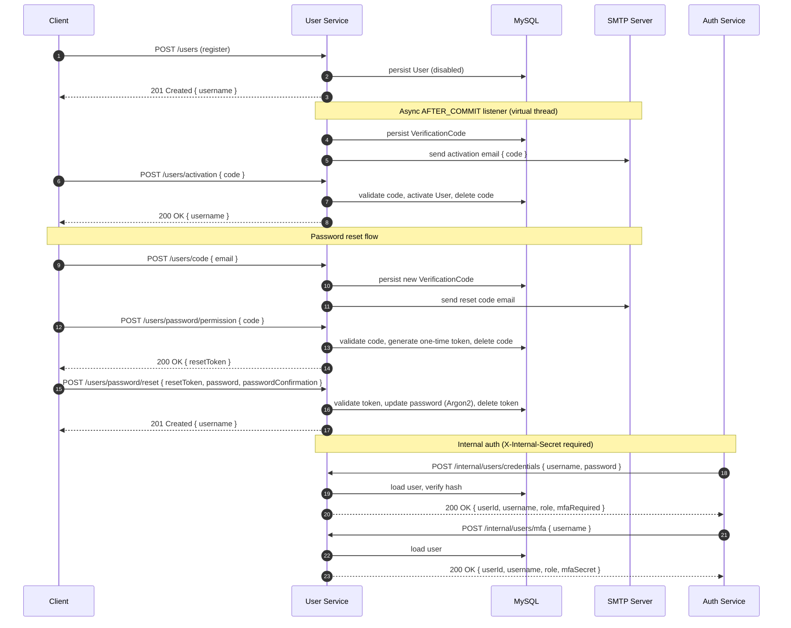
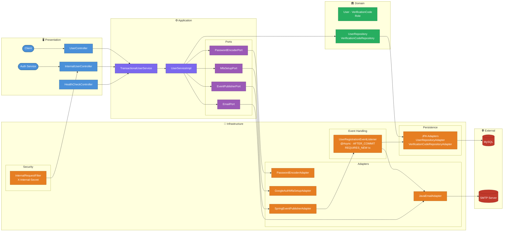

# 👤 User Service - Hexagonal User Management Platform

[](https://spring.io/projects/spring-boot)
[](https://openjdk.org/)
[](https://www.docker.com/)
[](https://opensource.org/licenses/MIT)

<a id="overview"></a>
## 📖 Overview
[Back to Table of Contents](#toc)

User Service is a production-ready backend handling the full user lifecycle — from registration through email activation, password reset, and MFA setup — exposing public endpoints for client-facing operations and secured internal endpoints consumed by other services (e.g. Auth Service). Built with Domain-Driven Design (DDD) and Hexagonal Architecture, using asynchronous event-driven email delivery and Argon2 password encoding.

<a id="toc"></a>
## 📚 Table of Contents
- [📖 Overview](#overview)
- [🔄 How It Works](#how-it-works)
- [🌐 API Endpoints](#api-endpoints)
- [🚀 Getting Started](#getting-started)
- [⚙️ Environment Variables](#environment-variables)
- [🛠️ Common Issues](#common-issues)
- [🏗️ Architecture](#architecture)
- [💻 Tech Stack](#tech-stack)
- [🧪 Testing Strategy](#testing-strategy)
- [📂 Repository Structure](#repository-structure)
- [🤝 Contact](#contact)

---

<a id="how-it-works"></a>
## 🔄 How It Works
[Back to Table of Contents](#toc)

### Registration & Activation

1. Client calls `POST /users` — service validates unique username/email and password match, creates a disabled `User`, and commits the transaction
2. `UserRegisteredEvent` is published; after the DB commit an async `UserRegistrationEventListener` opens a new transaction, generates a 6-digit `VerificationCode`, persists it, and sends an activation email
3. Client calls `POST /users/activation` with the code — service validates expiry, activates the user, and deletes the code

### Password Reset

4. Client calls `POST /users/code` — a new verification code is generated and emailed (same async path as activation)
5. Client calls `POST /users/password/permission` with the code — service validates expiry, generates a one-time reset token (UUID), stores it as a new `VerificationCode`, deletes the original code, and returns the token
6. Client calls `POST /users/password/reset` with `resetToken` + new password — service looks up the token, validates it, re-encodes the password, deletes the consumed token, and persists the update

### Internal Auth Integration

7. Auth Service calls `POST /internal/users/credentials` with `X-Internal-Secret` header — service verifies the password hash and returns `userId`, `username`, `role`, and `mfaRequired`
8. Auth Service calls `POST /internal/users/mfa` with `X-Internal-Secret` — service returns `userId`, `username`, `role`, and `mfaSecret` for TOTP validation



---

<a id="api-endpoints"></a>
## 🌐 API Endpoints
[Back to Table of Contents](#toc)

**Base URL:** `http://localhost:${SERVER_PORT}`

### User Endpoints (public)

| Method | Path | Purpose | Request Body | Success | Common Errors |
|--------|------|---------|--------------|---------|---------------|
| `POST` | `/users` | Register a new user | `RegisterUserRequestDto` | `201 Created` | `400`, `409` |
| `POST` | `/users/activation` | Activate account with email code | `ActivateUserRequestDto` | `200 OK` | `400`, `404`, `409` |
| `POST` | `/users/code` | Resend activation code | `ResendActivationCodeRequestDto` | `201 Created` | `404` |
| `POST` | `/users/password/permission` | Validate reset code, obtain reset token | `PasswordResetPermissionRequestDto` | `200 OK` | `400`, `404` |
| `POST` | `/users/password/reset` | Reset password | `ResetPasswordRequestDto` | `201 Created` | `400`, `404` |
| `PUT` | `/users/{userId}/role` | Change user role (admin only) | `ChangeUserRoleRequestDto` | `200 OK` | `400`, `403`, `404` |

### Internal Endpoints (X-Internal-Secret required)

| Method | Path | Purpose | Request Body | Success | Common Errors |
|--------|------|---------|--------------|---------|---------------|
| `POST` | `/internal/users/credentials` | Verify username/password | `VerifyCredentialsRequestDto` | `200 OK` | `401`, `403` |
| `POST` | `/internal/users/mfa` | Get MFA data for TOTP validation | `GetMfaDataRequestDto` | `200 OK` | `403`, `404` |

### Health Endpoints

| Method | Path | Purpose | Success |
|--------|------|---------|---------| 
| `GET` | `/` | Application health check | `200 OK` |
| `GET` | `/actuator/health` | Actuator health | `200 OK` |

### cURL Example

```bash
# Register a user
curl -X POST http://localhost:8083/users \
  -H "Content-Type: application/json" \
  -d '{"username": "john", "email": "john@example.com", "password": "Secret123!", "passwordConfirmation": "Secret123!"}'

# Activate account
curl -X POST http://localhost:8083/users/activation \
  -H "Content-Type: application/json" \
  -d '{"code": "482910"}'

# Verify credentials (internal)
curl -X POST http://localhost:8083/internal/users/credentials \
  -H "Content-Type: application/json" \
  -H "X-Internal-Secret: <your-secret>" \
  -d '{"username": "john", "password": "Secret123!"}'
```

---

<a id="getting-started"></a>
## 🚀 Getting Started
[Back to Table of Contents](#toc)

### Prerequisites

- Docker and Docker Compose v2+
- Java 25+ and Maven 3.9+ (for local builds only)
- An accessible SMTP server (e.g. Gmail, Mailgun, or a local MailHog instance)

### Environment Configuration

Copy the example and fill in secrets:

```bash
cp .env.example .env
```

See `.env.example` for all required variables with descriptions.

### Start the Service

```bash
docker-compose up -d --build
```

Verify: `curl http://localhost:8083/actuator/health` → `{"status":"UP"}`

---

<a id="environment-variables"></a>
## ⚙️ Environment Variables
[Back to Table of Contents](#toc)

### MySQL

| Variable | Required | Description | Default |
|----------|----------|-------------|---------|
| `USER_SERVICE_MYSQL_DB_HOST` | yes | MySQL host | `user-mysql` |
| `USER_SERVICE_MYSQL_DB_PORT` | yes | MySQL host port | `3309` |
| `USER_SERVICE_MYSQL_DB_NAME` | yes | Database name | `users_db` |
| `USER_SERVICE_MYSQL_DB_USER` | yes | DB user | `user` |
| `USER_SERVICE_MYSQL_DB_PASSWORD` | yes | DB user password | - |
| `USER_SERVICE_MYSQL_DB_ROOT_PASSWORD` | yes | MySQL root password | - |

### Application

| Variable | Required | Description | Default |
|----------|----------|-------------|---------|
| `USER_SERVICE_PORT` | yes | Host port mapped to the service | `8083` |
| `USER_SERVICE_APPLICATION_NAME` | yes | Spring application name | `user-service` |

### Mail

| Variable | Required | Description | Default |
|----------|----------|-------------|---------|
| `USER_SERVICE_MAIL_HOST` | yes | SMTP server hostname | `smtp.gmail.com` |
| `USER_SERVICE_MAIL_PORT` | yes | SMTP port | `587` |
| `USER_SERVICE_MAIL_USERNAME` | yes | SMTP login | - |
| `USER_SERVICE_MAIL_PASSWORD` | yes | SMTP password / app password | - |

### Security

| Variable | Required | Description | Default |
|----------|----------|-------------|---------|
| `USER_SERVICE_INTERNAL_SECRET` | yes | Shared secret for `/internal/*` routes (`X-Internal-Secret` header). Must match `AUTH_SERVICE_INTERNAL_SECRET` | - |
| `SPRINGDOC_API_DOCS_SWAGGER_ENABLED` | no | Enable Swagger UI | `false` |

---

<a id="common-issues"></a>
## 🛠️ Common Issues
[Back to Table of Contents](#toc)

1. **SMTP connection refused / activation emails not arriving** — verify `MAIL_HOST`, `MAIL_PORT`, `MAIL_USERNAME`, and `MAIL_PASSWORD`. For Gmail, generate an App Password and enable 2-Step Verification. Check logs with `docker-compose logs user-service | grep -i mail`.

2. **Database not ready / connection refused** — MySQL healthcheck must pass before the app starts. Inspect with `docker-compose ps user-mysql` and `docker-compose logs user-mysql`. HikariCP timeout is 2 000 ms with a pool of 20.

3. **403 Forbidden on `/internal/*`** — the `X-Internal-Secret` header must exactly match the `INTERNAL_SECRET` env var (constant-time comparison). Check the header name and value; there is no fallback.

4. **Verification code expired** — codes are valid for 5 minutes (`expiration-ms: 300000`). Call `POST /users/code` to request a new one.

---

<a id="architecture"></a>
## 🏗️ Architecture
[Back to Table of Contents](#toc)



**Technical Highlights:**

- **Hexagonal Architecture:** Domain and application layers are fully decoupled from infrastructure — ports define contracts (`EmailPort`, `MfaSetupPort`, `PasswordEncoderPort`, `EventPublisherPort`), adapters implement them.
- **Async Event-Driven Email:** `UserRegisteredEvent` is published within the registration transaction; `UserRegistrationEventListener` runs on a virtual thread after commit (`@Async` + `@TransactionalEventListener(AFTER_COMMIT)`) with its own new transaction (`REQUIRES_NEW`) — the HTTP response returns immediately and email failures never roll back registration.
- **Argon2 Password Encoding:** `PasswordEncoderAdapter` wraps Spring Security's Argon2 encoder — tunable via `password.encoder.type`.
- **Google Authenticator MFA:** `GoogleAuthMfaSetupAdapter` uses `googleauth` to generate TOTP secrets and QR URLs, stored per-user.
- **Internal Route Security:** `InternalRequestFilter` intercepts all `/internal/*` requests and validates `X-Internal-Secret` using constant-time comparison (`MessageDigest.isEqual`), returning `403` on mismatch.
- **Virtual Threads + container-aware JVM:** `spring.threads.virtual.enabled=true` with `-XX:+UseContainerSupport -XX:MaxRAMPercentage=75.0 -XX:+UseG1GC`.
- **Double Role Validation (Defense in Depth):** `changeUserRole()` first checks the requesting user's role from the database (source of truth), then compares it against the JWT-derived `X-User-Role` header. If they differ, a `RoleMismatchException` (403) signals possible token desynchronization.
- **One-Time Password Reset Token:** `getPasswordResetPermission()` validates the emailed code, generates a UUID token stored as a `VerificationCode`, and returns it. `resetPassword()` consumes and deletes the token — it cannot be reused.
- **Domain-Driven Design (DDD):** Rich `User` aggregate with lifecycle methods (`activate()`, `updatePassword()`, `enableMfa()`, `changeRole()`), decoupled from infrastructure via repository ports.

---

<a id="tech-stack"></a>
## 💻 Tech Stack
[Back to Table of Contents](#toc)

| Layer | Technology |
|-------|------------|
| Language | Java 25 (virtual threads via Project Loom) |
| Framework | Spring Boot 4.0.6 |
| Web | Spring WebMVC, Spring Validation |
| Persistence | Spring Data JPA, HikariCP (max-pool 20) |
| Database | MySQL |
| Password Encoding | Spring Security Crypto (Argon2), Bouncy Castle 1.78 |
| MFA | Google Authenticator (`googleauth` 1.5.0) |
| Email | Spring Boot Mail (JavaMailSender, SMTP + STARTTLS) |
| Build | Maven 3.9 |
| Testing | JUnit 5 |
| Containerisation | Docker, multi-stage build |
| Observability | Spring Boot Actuator |
| Utilities | Lombok |

---

<a id="testing-strategy"></a>
## 🧪 Testing Strategy
[Back to Table of Contents](#toc)

The project has comprehensive unit and integration tests covering all layers of the hexagonal architecture (JUnit 5 + AssertJ + Mockito + Testcontainers).

### Test Classes

#### Unit Tests

| Class | Scope |
|-------|-------|
| `UserTest` | Domain model: `activate()`, `updatePassword()`, `enableMfa()`, `changeRole()` lifecycle, `isAdmin()` |
| `VerificationCodeTest` | Domain model: `isExpired()` logic |
| `UserServiceImplTest` | Application service: registration, activation, password reset (with one-time token), MFA setup, credential verification, role change (with double validation + `RoleMismatchException`) |
| `TransactionalUserServiceTest` | Transactional decorator delegates to `UserServiceImpl` |
| `JavaEmailAdapterTest` | Email adapter: sends `SimpleMailMessage` via `JavaMailSender` |
| `SpringEventPublisherAdapterTest` | Event publisher adapter: publishes `UserRegisteredEvent` |
| `UserRegistrationEventListenerTest` | Async listener: generates code, sends email on `UserRegisteredEvent` |
| `GoogleAuthMfaSetupAdapterTest` | MFA adapter: generates TOTP secret + QR URL |
| `PasswordEncoderAdapterTest` | Password encoder: Argon2 encode + matches |
| `InternalRequestFilterTest` | Security filter: constant-time `X-Internal-Secret` validation |
| `UserRepositoryAdapterTest` | Persistence adapter: user CRUD via JPA |
| `VerificationCodeRepositoryAdapterTest` | Persistence adapter: verification code CRUD via JPA |
| `UserMapperTest` | Entity ↔ domain model mapping |
| `VerificationCodeMapperTest` | Entity ↔ domain model mapping |
| `GlobalExceptionHandlerTest` | Exception handler: all domain exceptions → correct HTTP status (including `RoleMismatchException` → 403) |

#### Integration Tests

| Class | Scope |
|-------|-------|
| `UserFlowIntegrationTest` | Full flow with Testcontainers MySQL: register → activate → verifyCredentials, password reset with one-time token, MFA setup, role change (admin promotion + mismatch rejection), duplicate guards, inactive account guard |

```bash
mvn test        # runs all tests
mvn verify      # full build including integration tests
```

---

<a id="repository-structure"></a>
## 📂 Repository Structure
[Back to Table of Contents](#toc)

```text
.
├── src/
│   ├── main/
│   │   ├── java/com/rzodeczko/
│   │   │   ├── application/
│   │   │   │   ├── command/              # ChangeUserRoleCommand, GetMfaDataCommand,
│   │   │   │   │                         #   RegisterUserCommand, ResetPasswordCommand,
│   │   │   │   │                         #   VerifyCredentialsCommand
│   │   │   │   ├── dto/                  # MfaDataResultDto, MfaSetupResultDto,
│   │   │   │   │                         #   UserCredentialsResultDto
│   │   │   │   ├── event/                # UserRegisteredEvent
│   │   │   │   ├── port/                 # EmailPort, EventPublisherPort,
│   │   │   │   │                         #   MfaSetupPort, PasswordEncoderPort
│   │   │   │   └── service/              # UserService (interface),
│   │   │   │                             #   UserServiceImpl
│   │   │   ├── domain/
│   │   │   │   ├── exception/            # EmailAlreadyExistsException,
│   │   │   │   │                         #   InsufficientRoleException,
│   │   │   │   │                         #   InvalidCredentialsException,
│   │   │   │   │                         #   MfaAlreadyActivatedException,
│   │   │   │   │                         #   PasswordMismatchException,
│   │   │   │   │                         #   RoleMismatchException,
│   │   │   │   │                         #   UserAlreadyActivatedException,
│   │   │   │   │                         #   UserNotActivatedException,
│   │   │   │   │                         #   UserNotFoundException,
│   │   │   │   │                         #   UsernameAlreadyExistsException,
│   │   │   │   │                         #   VerificationCodeExpiredException,
│   │   │   │   │                         #   VerificationCodeNotFoundException
│   │   │   │   ├── model/                # User, VerificationCode, Role
│   │   │   │   └── repository/           # UserRepository, VerificationCodeRepository
│   │   │   ├── infrastructure/
│   │   │   │   ├── configuration/        # BeanConfiguration,
│   │   │   │   │   └── properties/       #   InternalSecurityProperties,
│   │   │   │   │                         #   MfaProperties, PasswordEncoderProperties,
│   │   │   │   │                         #   UserActivationProperties
│   │   │   │   ├── email/                # JavaEmailAdapter
│   │   │   │   ├── event/                # SpringEventPublisherAdapter,
│   │   │   │   │                         #   UserRegistrationEventListener
│   │   │   │   ├── mfa/                  # GoogleAuthMfaSetupAdapter
│   │   │   │   ├── persistence/
│   │   │   │   │   ├── adapter/          # UserRepositoryAdapter,
│   │   │   │   │   │                     #   VerificationCodeRepositoryAdapter
│   │   │   │   │   ├── entity/           # UserEntity, VerificationCodeEntity
│   │   │   │   │   ├── mapper/           # UserMapper, VerificationCodeMapper
│   │   │   │   │   └── repository/       # JpaUserRepository,
│   │   │   │   │                         #   JpaVerificationCodeRepository
│   │   │   │   ├── security/             # InternalRequestFilter,
│   │   │   │   │                         #   PasswordEncoderAdapter
│   │   │   │   └── service/tx/           # TransactionalUserService
│   │   │   └── presentation/
│   │   │       ├── controller/           # UserController, InternalUserController,
│   │   │       │                         #   HealthCheckController
│   │   │       ├── dto/
│   │   │       │   ├── request/          # ActivateUserRequestDto,
│   │   │       │   │                     #   ChangeUserRoleRequestDto,
│   │   │       │   │                     #   GetMfaDataRequestDto,
│   │   │       │   │                     #   PasswordResetPermissionRequestDto,
│   │   │       │   │                     #   RegisterUserRequestDto,
│   │   │       │   │                     #   ResendActivationCodeRequestDto,
│   │   │       │   │                     #   ResetPasswordRequestDto,
│   │   │       │   │                     #   VerifyCredentialsRequestDto
│   │   │       │   └── response/         # ApiResponseDto, HealthCheckResponseDto,
│   │   │       │                         #   MfaDataResponseDto,
│   │   │       │                         #   UserCredentialsResponseDto
│   │   │       └── exception/            # GlobalExceptionHandler
│   │   └── resources/
│   │       └── application.yaml          # App config (virtual threads, HikariCP,
│   │                                     #   mail, MFA issuer, activation settings)
│   └── test/
│       └── java/com/rzodeczko/
│           ├── AbstractIntegrationTest.java                         # Testcontainers MySQL base
│           ├── UserFlowIntegrationTest.java                         # Full flow integration tests
│           ├── application/service/impl/
│           │   └── UserServiceImplTest.java                         # Service unit tests
│           ├── domain/model/
│           │   ├── UserTest.java                                    # User domain model tests
│           │   └── VerificationCodeTest.java                        # VerificationCode tests
│           ├── infrastructure/
│           │   ├── email/
│           │   │   └── JavaEmailAdapterTest.java                    # Email adapter tests
│           │   ├── event/
│           │   │   ├── SpringEventPublisherAdapterTest.java         # Event publisher tests
│           │   │   └── UserRegistrationEventListenerTest.java       # Async listener tests
│           │   ├── mfa/
│           │   │   └── GoogleAuthMfaSetupAdapterTest.java           # MFA adapter tests
│           │   ├── persistence/
│           │   │   ├── adapter/
│           │   │   │   ├── UserRepositoryAdapterTest.java           # User repo adapter tests
│           │   │   │   └── VerificationCodeRepositoryAdapterTest.java
│           │   │   └── mapper/
│           │   │       ├── UserMapperTest.java                      # Mapper tests
│           │   │       └── VerificationCodeMapperTest.java
│           │   ├── security/
│           │   │   ├── InternalRequestFilterTest.java               # Security filter tests
│           │   │   └── PasswordEncoderAdapterTest.java              # Argon2 encoder tests
│           │   └── service/tx/
│           │       └── TransactionalUserServiceTest.java            # Tx decorator tests
│           └── presentation/exception/
│               └── GlobalExceptionHandlerTest.java                  # Exception handler tests
├── Dockerfile                            # Multi-stage build (maven → jre-alpine, non-root user)
└── pom.xml                               # Maven build descriptor
```

---

<a id="contact"></a>
## 🤝 Contact
[Back to Table of Contents](#toc)

Designed and implemented by **Michał Rzodeczko**.

GitHub: [mrzodeczko-dev](https://github.com/mrzodeczko-dev)
