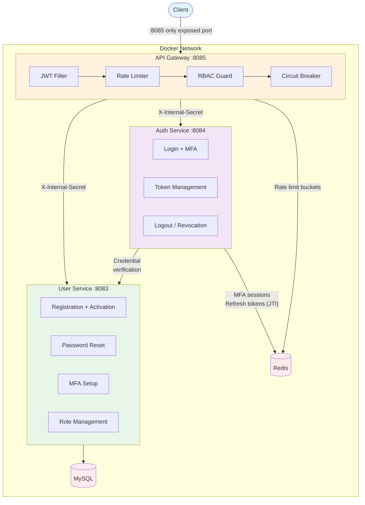

# Security Platform

[](https://spring.io/projects/spring-boot)
[](https://openjdk.org/)
[](https://www.docker.com/)
[](https://helm.sh/)
[](https://github.com/mrzodeczko-dev/security-platform/actions/workflows/ci-user-service.yml)
[](https://github.com/mrzodeczko-dev/security-platform/actions/workflows/ci-auth-service.yml)
[](https://github.com/mrzodeczko-dev/security-platform/actions/workflows/ci-api-gateway-service.yml)
[](https://github.com/mrzodeczko-dev/security-platform/actions/workflows/e2e.yml)
[](https://opensource.org/licenses/MIT)

Monorepo for a microservice-based authentication and user management platform, built with **Spring Boot 4.0.6**, **Java 25**, and **Hexagonal Architecture**. Production-ready with Helm chart, Prometheus observability, E2E test suite, and automated Docker Hub publishing.

## Services

| Service | Port | Description |
|---------|------|-------------|
| **API Gateway** | 8085 | JWT validation, RBAC, rate limiting (Bucket4j + Redis), circuit breaker (Resilience4j), request forwarding |
| **Auth Service** | 8084 | Login, MFA (TOTP), JWT token pair with JTI binding & rotation, server-side revocation via Redis |
| **User Service** | 8083 | Registration, email activation, password reset (one-time token), MFA setup, role management |

## Architecture



The gateway is the only publicly exposed service. Auth and User services communicate via internal network with `X-Internal-Secret` header validation.

## Quick Start (Docker Compose)

```bash
cp .env.example .env
# Fill in secrets (JWT_SECRET, DB passwords, SMTP credentials, INTERNAL_SECRET)
docker compose up -d --build
curl http://localhost:8085/actuator/health
```

## Kubernetes Deployment (Helm)

The project includes a production-grade Helm chart in `helm/security-platform/`.

```bash
# 1. Create secrets file from template
cp helm/security-platform/secrets.example.yaml helm/security-platform/secrets.yaml
# Fill in real values (JWT_SECRET, DB/Redis passwords, INTERNAL_SECRET, SMTP)

# 2. Install
helm install security-platform ./helm/security-platform \
  -f helm/security-platform/secrets.yaml \
  -n security-platform --create-namespace

# 3. Verify
kubectl get pods -n security-platform -l app.kubernetes.io/part-of=security-platform
```

Images are pulled from Docker Hub (`mrzodeczko/security-platform-*`) by default. Override the registry, namespace, or tag in `values.yaml` under `global.image`.

### Security hardening

All containers run as non-root (`uid=1000`) with read-only root filesystem, `ALL` capabilities dropped, and a `RuntimeDefault` seccomp profile. The only writable mount is an `emptyDir` at `/tmp` for Spring Boot's temporary files.

### Scaling and availability

Each service has an HPA (CPU/memory targets configurable per service) and a PodDisruptionBudget (`minAvailable: 1`). Pod anti-affinity spreads replicas across nodes; topology spread constraints distribute them across availability zones.

### NetworkPolicies

When `networkPolicy.enabled=true` (default), five NetworkPolicies enforce least-privilege traffic: the API Gateway accepts ingress only from the `ingress-nginx` namespace and can reach Auth Service, User Service, and Redis. Auth Service accepts only from the Gateway and can reach User Service and Redis. User Service accepts from Gateway and Auth Service, can reach MySQL and external SMTP (ports 587/465). MySQL accepts only from User Service. Redis accepts only from Auth Service and Gateway. All policies allow DNS egress (port 53).

### Ingress and TLS

The chart creates an `nginx` Ingress with cert-manager annotation (`letsencrypt-prod` cluster issuer) for automatic TLS. Configure your domain under `ingress.hosts` and `ingress.tls` in `values.yaml`.

### External database / cache

MySQL and Redis are deployed as StatefulSet/Deployment by default. To use managed services (RDS, ElastiCache, Cloud SQL, Memorystore), set `mysql.enabled=false` / `redis.enabled=false` and configure `mysql.external.host` / `redis.external.host` in `values.yaml`.

### Observability

All services expose Prometheus metrics via Micrometer at `/actuator/prometheus`. The Helm chart adds scrape annotations automatically when `monitoring.enabled=true` (default). Each deployment configures three Spring Actuator probes: startup (`/actuator/health`), liveness (`/actuator/health/liveness`), and readiness (`/actuator/health/readiness`).

## Repository Structure

```
security-platform/
├── services/
│   ├── api-gateway-service/         # Reverse proxy, JWT, rate limiting, circuit breaker
│   ├── auth-service/                # Authentication & token management
│   └── user-service/                # User lifecycle management
├── e2e-tests/                       # End-to-end test suite (docker-compose based)
│   └── docker-compose.yml           # Test environment (MySQL, Redis, MailHog, 3 services)
├── helm/
│   └── security-platform/           # Production Helm chart
│       ├── Chart.yaml
│       ├── values.yaml
│       ├── secrets.example.yaml
│       └── templates/
│           ├── infrastructure/      # MySQL StatefulSet, Redis Deployment
│           ├── user-service/        # Deployment, Service, HPA, PDB
│           ├── auth-service/        # Deployment, Service, HPA, PDB
│           ├── api-gateway/         # Deployment, Service, HPA, PDB
│           └── network/             # Ingress, NetworkPolicies
├── .github/workflows/
│   ├── ci-user-service.yml          # Unit + integration tests
│   ├── ci-auth-service.yml          # Unit + integration tests
│   ├── ci-api-gateway-service.yml   # Unit + integration tests
│   ├── e2e.yml                      # Full-stack E2E tests
│   └── dockerhub-publish-images.yml # Push images after successful E2E
├── docker-compose.yml               # Full stack (MySQL + Redis + 3 services)
├── .env.example                     # All environment variables
└── pom.xml                          # Maven parent (shared versions)
```

## CI/CD

The project uses GitHub Actions with five workflows:

Three **per-service CI** workflows run unit and integration tests (with Testcontainers) on push/PR. The **E2E workflow** builds all Docker images, starts the full stack with docker compose, and runs end-to-end tests including rate limiting verification. On success, the **Publish workflow** (`workflow_run` trigger) pushes versioned images (`YYYY-MM-DD-<run_number>`) and `latest` tags to Docker Hub.

Docker Hub images: `mrzodeczko/security-platform-user-service`, `mrzodeczko/security-platform-auth-service`, `mrzodeczko/security-platform-api-gateway-service`.

## Tech Stack

| Layer | Technology |
|-------|-----------|
| Language | Java 25 |
| Framework | Spring Boot 4.0.6 |
| Auth | JWT (jjwt 0.12.5), TOTP (GoogleAuth) |
| Rate Limiting | Bucket4j + Redis |
| Circuit Breaker | Resilience4j |
| Database | MySQL 9.6 |
| Cache | Redis 8.2 |
| Observability | Micrometer + Prometheus |
| API Docs | SpringDoc OpenAPI 3 |
| Testing | JUnit 5, Testcontainers, WireMock, RestAssured |
| Deployment | Docker, Helm 3, Kubernetes |
| CI/CD | GitHub Actions |

## Contact

Designed and implemented by **Michal Rzodeczko**.
GitHub: [mrzodeczko-dev](https://github.com/mrzodeczko-dev)
